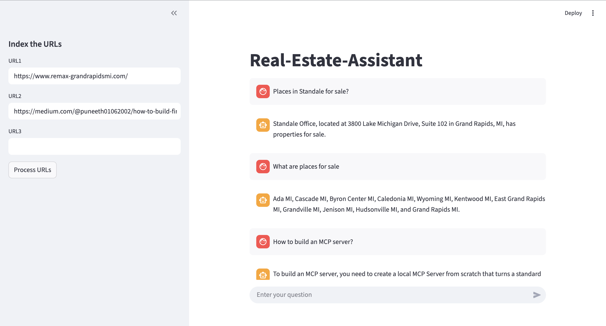

# Real Estate Assistant 🏡

An intelligent AI-powered chatbot that helps you get instant answers from real estate websites using Retrieval-Augmented Generation (RAG). Simply index any real estate website URLs and ask questions about properties, pricing, features, and more!



## 🌟 Features

- **URL Indexing**: Process multiple real estate website URLs at once
- **Smart Document Processing**: Automatically extracts and chunks content from web pages
- **Semantic Search**: Uses HuggingFace embeddings for accurate document retrieval
- **Conversational AI**: Powered by OpenAI's GPT models for natural language understanding
- **Persistent Vector Store**: ChromaDB-based storage for efficient similarity search
- **Chat History**: Maintains conversation context for follow-up questions
- **Real-time Status Updates**: Visual feedback during indexing and query processing

## 🏗️ Architecture

This project uses a modern RAG (Retrieval-Augmented Generation) pipeline:

1. **Document Loading**: WebBaseLoader fetches content from provided URLs
2. **Text Splitting**: RecursiveCharacterTextSplitter creates manageable chunks
3. **Embedding**: HuggingFace Sentence Transformers generate embeddings
4. **Vector Store**: ChromaDB stores embeddings for similarity search
5. **Retrieval**: Similarity search finds relevant document chunks
6. **Generation**: OpenAI GPT generates context-aware answers

## 🚀 Getting Started

### Prerequisites

- Python 3.11 or higher
- OpenAI API key

### Installation

1. Clone the repository:
```bash
git clone <your-repo-url>
cd Real-Estate-Assistant
```

2. Install dependencies:
```bash
pip install -e .
```

3. Create a `.env` file in the project root and add your OpenAI API key:
```env
OPENAI_API_KEY=your_api_key_here
```

### Usage

#### Running the Streamlit App

Launch the interactive web interface:

```bash
streamlit run main.py
```

Then:
1. Enter up to 3 real estate website URLs in the sidebar
2. Click "Process URLs" to index the content
3. Ask questions in the chat interface about the indexed properties

#### Running as a Script

You can also use the RAG pipeline directly:

```bash
python3 rag.py
```

Edit the `urls` and `query` variables in the `__main__` block to test with different sources.

## 📁 Project Structure

```
Real-Estate-Assistant/
├── main.py                 # Streamlit frontend application
├── rag.py                  # Core RAG pipeline implementation
├── pyproject.toml          # Project dependencies and metadata
├── .env                    # Environment variables (create this)
├── README.md               # Project documentation
├── images/                 # Screenshots and images
│   └── frontend.png
└── resources/
    └── vectorstore/        # ChromaDB persistent storage
        └── chroma.sqlite3  # Vector database
```

## 🛠️ Technologies Used

- **Streamlit**: Interactive web interface
- **LangChain**: RAG pipeline orchestration
- **OpenAI GPT**: Language model for answer generation
- **HuggingFace Transformers**: Sentence embeddings (`all-MiniLM-L6-v2`)
- **ChromaDB**: Vector database for document storage
- **Python 3.11+**: Core programming language

## 💡 Example Use Cases

- **Property Research**: "What are the key features of this property?"
- **Pricing Information**: "What is the price range for apartments in this listing?"
- **Amenities**: "What amenities are included?"
- **Location Details**: "Tell me about the neighborhood and nearby facilities"
- **Comparison**: Index multiple property listings and compare them

## ⚙️ Configuration

You can modify these constants in [rag.py](rag.py):

- `chunck_size`: Size of text chunks (default: 1000 characters)
- `embedding_model`: HuggingFace model for embeddings
- `collection_name`: ChromaDB collection name
- `search_kwargs`: Number of similar documents to retrieve (default: k=2)

## 🔒 Environment Variables

Create a `.env` file with:

```env
OPENAI_API_KEY=your_openai_api_key
```

## 📝 How It Works

1. **Indexing Phase**:
   - User provides website URLs
   - Content is scraped and split into chunks
   - Embeddings are generated and stored in ChromaDB

2. **Query Phase**:
   - User asks a question
   - Relevant document chunks are retrieved via similarity search
   - Context and question are formatted into a prompt
   - OpenAI generates an answer based only on the retrieved context

## 🤝 Contributing

Contributions are welcome! Feel free to:
- Report bugs
- Suggest new features
- Submit pull requests

## 📄 License

This project is open source and available under the MIT License.

## 🙏 Acknowledgments

- Built with [LangChain](https://langchain.com/)
- Powered by [OpenAI](https://openai.com/)
- Embeddings by [HuggingFace](https://huggingface.co/)

---

**Note**: This assistant only answers questions based on the indexed content. For best results, index comprehensive real estate listing pages with detailed property information.